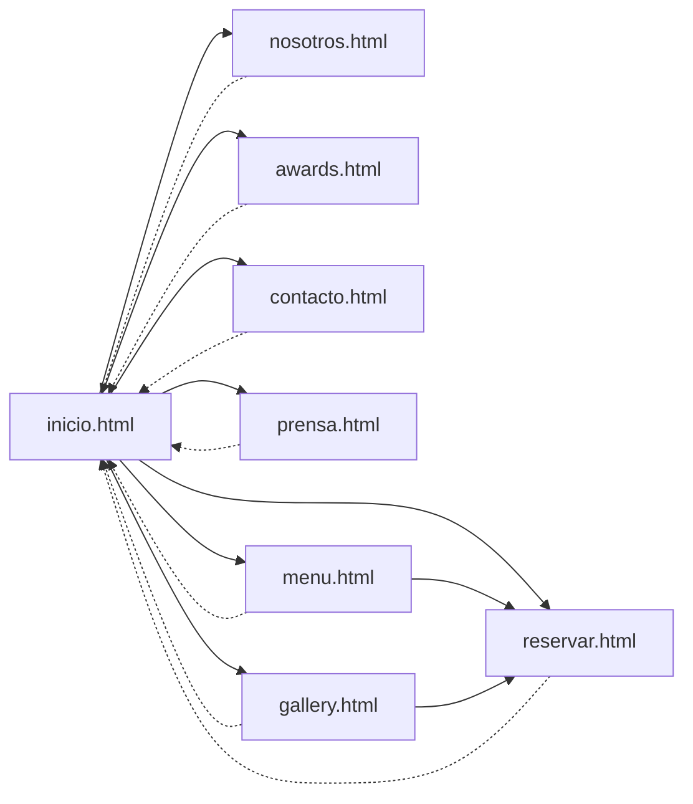
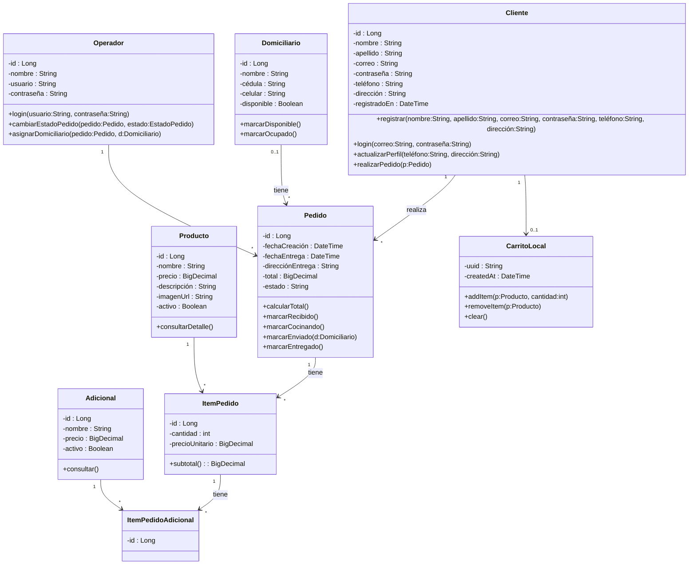
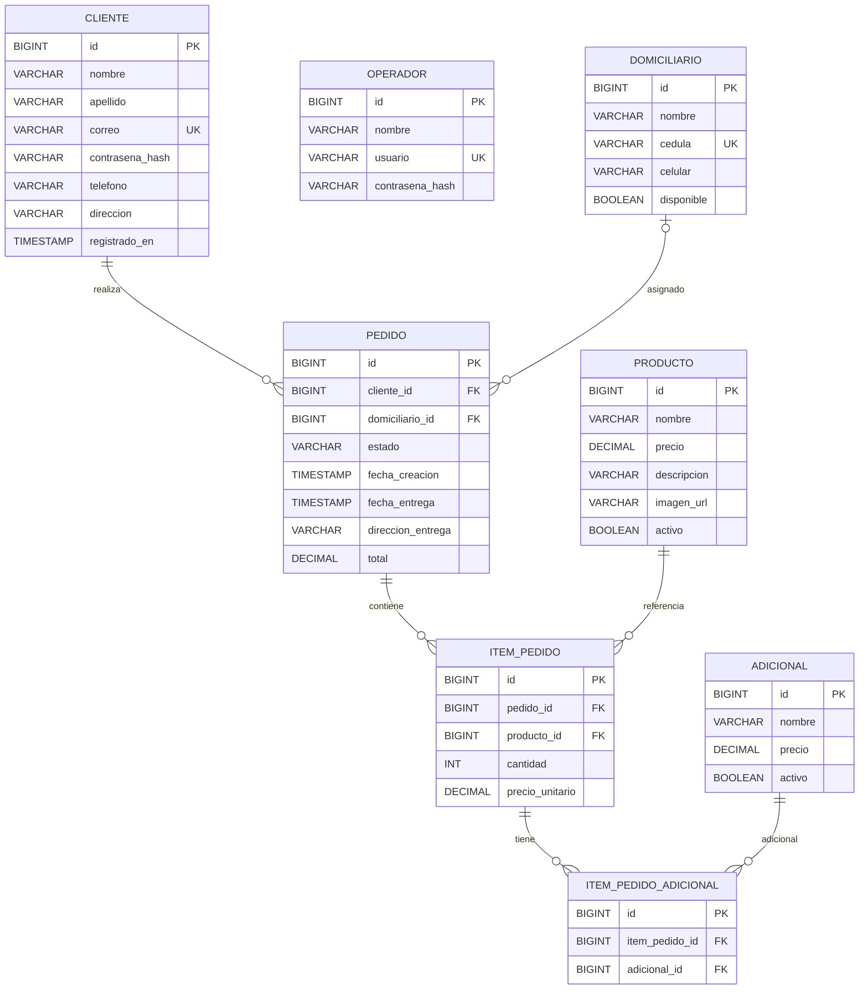

# desarrolloWeb# soberbio
-------------------------------------------------------------------------------
# Diagrama de navegacion

  -------------------------------------------------------------------------------
# UML

  -------------------------------------------------------------------------------
# ERD

  -------------------------------------------------------------------------------
## 🎨 Paleta de colores
Basando en la pagina web del restaurantr [El Chato](https://elchato.co) 

### Brand color
- `#FFF` → **texto (Blanco)**

### Supporting colors
- `#19191B` → **fondo (gris)**
- `#212529` → **texto (gris claro)**

### Ocacional
- `#ffc107` → **imagenes (amarillo opaco)**
